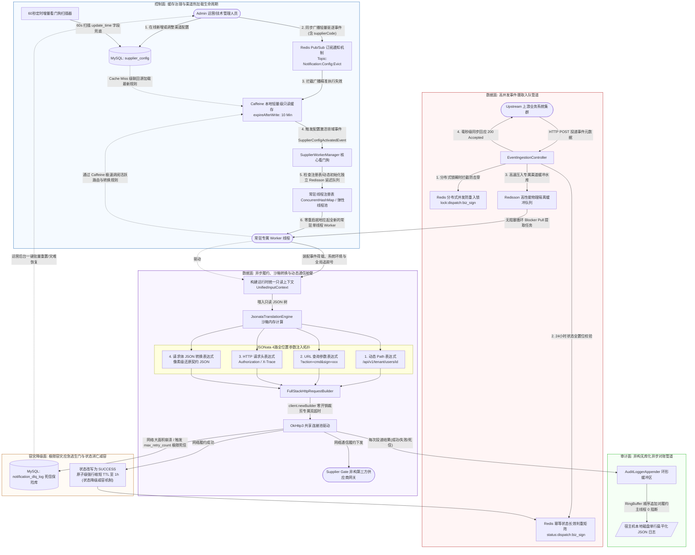
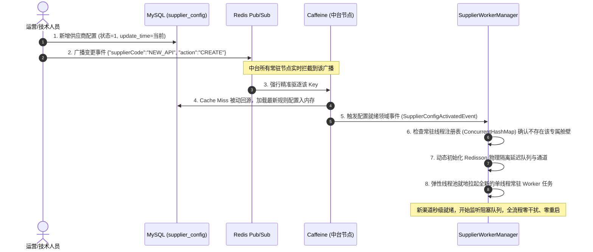

# Design Document

## Overview

本设计文档旨在定义与规范企业级 **API 通知中台与防腐层网关（ACL Gateway）** 的核心架构与流转细节。该系统作为核心中枢，上游连接内部异构业务线（广告引流、订阅支付、订单履约等），下游对接多样式、多协议的外部供应商（第三方广告系统、外置 CRM、异构短信网关、仓储物流系统等）。

系统解决的核心业务与技术痛点包括：

* **消除协议撕裂**：下游供应商接口极不规范，鉴权繁琐，且参数杂乱分布在 **Path、Query、Header、Body** 等不同位置。
* **极端资源隔离**：防止部分慢速供应商的长尾延迟击穿中台常驻消费线程，导致全局雪崩。
* **10分钟动态上线**：要求技术或运营人员在**零代码修改、零服务重启**的前提下，在 10 分钟内完成新渠道的完整配置、调试与动态热加载上线。

本系统通过引入**统一输入上下文拓扑**、**沙箱化 JSONata 声明式转换引擎**、**双超时像素级物理隔离**、**Redis 幂等状态降级矩阵**以及**异构无库化异步审计管道**，在保障绝对安全（0-RCE 风险）的前提下，实现极限并发吞吐与极致的开发/配置体验（DX）。

## Steering Document Alignment

### Technical Standards (./.spec-workflow/steering/tech.md)

本设计严密对齐企业核心技术规约：

* **核心运行时**：基于 Java 17 LTS 与 Spring Boot 3.2.x 运行时骨架，全面剔除不安全的动态反射与硬编码组件。
* **动态计算引擎**：严禁引入具备原生 JVM 访问原语的表达式语言（如 SpEL、Ognl、MVEL），全量采用闭环内存沙箱架构的 `jsonata-java` 作为标准参数转换 DSL。
* **通信与履约**：基于 OkHttp3 组建高性能动态衍生连接池，支持长连接复用（Keep-Alive）与单请求级别的像素级超时裁剪。
* **中间件高并发缓冲**：依赖 Redis (Redisson 客户端) 实现高吞吐分布式队列与临界区并发锁。
* **审计存储**：严格贯彻“正常流转不占关系型 I/O”铁律。

### Project Structure (./.spec-workflow/steering/structure.md)

系统架构遵循标准 **领域驱动设计（DDD）** 与 **干净架构（Clean Architecture）** 规范，严格隔离边界。完整目录结构与命名规范详见 [structure.md](./.spec-workflow/steering/structure.md)。

项目由两个一级目录组成：

* **`notification-service/`**：Spring Boot 后端服务，DDD 四层架构（interfaces → application → domain → infrastructure）
* **`notification-admin-ui/`**：Vue 3 SPA 管理后台前端

## Code Reuse Analysis

### Existing Components to Leverage

为避免重复造轮子并保障性能，本设计深度复用以下基础及三方核心组件：

* **`ObjectMapper` (Jackson)**：复用其高效的树状节点转换能力，将输入报文一次性反序列化为通用的 Map 结构，供 JSONata 引擎高并发多路安全读取。
* **`RedissonClient`**：利用其成熟的分布式锁（`RLock`）处理极短时间内的并发击穿防护，利用其高可靠队列（`RQueue`）作为高并发吞吐的流量蓄水池。
* **Caffeine Cache**：引入轻量级进程内缓存，在 Redis 不可用时临时接管“短效防重入锁”的功能。
* **`Logback AsyncAppender`**：直接复用日志框架底层的环形缓冲区（RingBuffer）和无锁顺序追加特性，实现极致轻量的“本地流式写磁盘”，作为审计数据源。

### Integration Points

* **上游业务接入点**：提供统一的 `/api/v1/notifications/ingest` HTTP POST 接口，接收标准事件头与自定义 Meta Payload。
* **下游外部供应商端点**：由 `FullStackHttpRequestBuilder` 动态解析出的异构 HTTP(S) 接口，支持 GET, POST, PUT, PATCH 等多种请求谓词。

## Architecture

### Modular Design Principles

本架构设计的核心原则是“高并发无库化流转”**与**“配置人员 DX 黄金闭环”：

1. **单组件职责单一**：接收层只管快速入队并回应上游；常驻 Worker 专注于事件履约与网络通信；计算引擎只做纯粹的闭环内存转换。
2. **物理与计算资源完全解耦**：成功通知的履约记录不占用 MySQL 事务与任何 I/O。
3. **四路并行参数泛化解析**：将复杂的异构 HTTP 参数拆解为 Path、Query、Header、Body 四路独立的 JSONata 表达式，统一输入、按需计算，彻底封杀接口变形带来的代码改动。



### Cache Governance & Hot Loading Lifecycle

为了保障配置变更的准实时性（秒级生效）、多节点数据强一致性以及新增异构渠道的“零重启”热加载能力，特确立以下机制：

* **三位一体缓存刷新与失效模型**：本地 Caffeine 缓存采用主被动结合的多路防御架构。管理后台发生任何配置更新，通过 Redis Pub/Sub（Topic 频道: `Notification:Config:Evict`）向中台集群广播轻量级驱逐通知，中台节点精准执行 `cache.invalidate(supplierCode)`。同时，中台常驻轻量级调度器每 60 秒扫描一次 MySQL 的 `update_time` 作为定时看门狗兜底。Caffeine 本地缓存统一配置 `expireAfterWrite(10, TimeUnit.MINUTES)` 作为底线失效防御。
* **新增异构渠道“零重启（Zero-Restart）”动态孵化闭环**：系统严禁为了上线新渠道或修改在线参数而重启中台集群。当新增供应商配置在后台激活，触发配置就绪领域事件（`SupplierConfigActivatedEvent`），`SupplierWorkerManager` 检查常驻线程注册表，动态初始化 Redisson 物理隔离延迟队列与通道，并由弹性线程池就地拉起全新的单线程常驻 Worker 任务。



---

## Components and Interfaces

### Component 1: EventIngestionController (高并发事件接收端点)

* **Purpose**: 负责高速接收各上游系统投递的异步通知事件。要求在毫秒级内完成基础参数校验、分布式并发锁拦截、压入 Redisson 队列，并即刻对上游做出响应，彻底阻断由于下游外部供应商故障引发的上游级联卡死。
* **Interfaces**:

```java
@PostMapping("/api/v1/notifications/ingest")
public ResponseEntity<IngestResponse> ingestEvent(@Valid @RequestBody NotificationEventDto eventDto);

```

### Component 2: SupplierWorkerManager (常驻消费与线程生命周期看门狗)

* **Purpose**: 系统核心驱动 Worker 管理器。负责动态孵化各个独立供应商的常驻轮询线程，维护红线隔离舱壁；同时监听配置变更事件，驱动线程池进行”零重启”动态调整。
* **线程池容量治理**：弹性线程池通过 `max-worker-threads` 配置项（默认 200，可通过 Spring 外部化配置覆盖）设定硬上限。当活跃线程总数（所有供应商的 `worker_concurrency` 之和）逼近上限时，`initAndLaunchWorkers()` 拒绝拉起新线程并抛出 `WorkerCapacityExhaustedException`，同时触发 P2 告警。运营人员须通过禁用低优先级供应商释放线程配额，或调整 `max-worker-threads` 后由看门狗自动扩容。
* **单供应商多 Worker 并发**：每个供应商通过 `supplier_config.worker_concurrency` 字段配置消费线程数（默认 1）。高流量供应商可设置为 N（如 5），系统为该供应商分配 N 个 Worker 线程共享同一个 `RDelayedQueue`，线程间通过 Redisson 队列的原子 `poll` 操作天然互斥，无需额外协调。线程总数硬上限仍受 `max-worker-threads` 约束。
* **Interfaces**:

```java
public void initAndLaunchWorkers(); // 系统启动时初始化各渠道物理隔离队列常驻 Worker（按 worker_concurrency 拉起多线程）
public void handleConfigActivatedEvent(SupplierConfigActivatedEvent event); // 响应新渠道激活，动态拉起新线程
public int getActiveWorkerCount(); // 查询当前活跃 Worker 线程总数
public int getMaxWorkerThreads(); // 查询线程池硬上限

```

#### 优雅停机生命周期（Graceful Shutdown）

`SupplierWorkerManager` 实现 Spring `SmartLifecycle` 接口，在应用关闭（部署更新、扩缩容）时按以下步骤有序停机：

1. **设置停机标志位**：`shutdownRequested = true`，所有 Worker 线程在下一次循环检查时感知到该标志，停止从 `RDelayedQueue` 拉取新任务。
2. **等待在途请求完成**：给予正在执行网络通信的 Worker 一个可配置的等待窗口（`shutdown-await-seconds`，默认 30 秒）。在窗口内，Worker 完成当前投递并写出审计日志后自行退出。
3. **超时强制中断**：超过等待窗口后，对仍未退出的 Worker 线程执行 `Thread.interrupt()`。被中断的 Worker 捕获 `InterruptedException`，将当前任务重新压回 Redisson 队列（确保不丢消息），然后退出。
4. **资源释放**：清理线程注册表、关闭 Redisson 队列引用。未消费的消息保留在 Redis 队列中，待新实例启动后自动恢复消费。

```java
// SmartLifecycle 接口实现
public int getPhase(); // 返回 Integer.MAX_VALUE - 1，确保 Worker 在其他 Bean 之前停机
public void stop(Runnable callback); // 有序停机入口，完成后调用 callback 通知 Spring 容器
```

---

### Component 3: JsonataTranslationEngine (沙箱化声明式转换引擎)

* **Purpose**: 纯内存闭环计算引擎。作为整个系统的安全防腐底座，输入上游完整元数据，根据渠道配置的 JSONata 表达式，精准、无 RCE 风险地输出目标字符串。
* **Interfaces**:

```java
public String transform(String jsonataExpression, Object inputContext);
public String transformWithBindings(String jsonataExpression, Object inputContext, Map<String, Object> bindings);

```

### Component 4: FullStackHttpRequestBuilder (全位置参数动态组装器)

* **Purpose**: 接收计算引擎输出的 **Path、Query、Header、Body** 四路标准 JSON 数据，利用 OkHttp 机制像素级还原第三方网关所需的网络请求实体，并基于该渠道的特性动态裁剪出具备专属超时的轻量客户端。
* **Interfaces**:

```java
public Request buildRequest(SupplierConfig config, Object inputContext) throws Exception;
public OkHttpClient deriveClient(SupplierConfig config); // 基于全局连接池动态衍生出包含特定 connect/read 超时的客户端

```

### Component 5: CredentialVault (供应商凭证安全保险柜)

* **Purpose**: 统一管理供应商敏感凭证的加解密生命周期。从 `supplier_config.credentials_encrypted` 字段读取 AES-256-GCM 密文，在 Worker 构建 `UnifiedInputContext` 时解密并注入 `auth` 子树，供 JSONata 表达式安全引用。加密主密钥（Master Key）通过 Spring 外部化配置（环境变量 `CREDENTIAL_MASTER_KEY`）注入，严禁硬编码或提交至版本控制。
* **Interfaces**:

```java
public Map<String, Object> decrypt(String encryptedCredentials); // 解密供应商凭证密文,返回明文KV结构
public String encrypt(Map<String, Object> plainCredentials);     // 加密供应商凭证明文,供管理后台写入时调用

```

### Component 6: AuditLoggerAppender (高性能异步流式审计组件)

* **Purpose**: 在 Worker 每次执行投递后（无论成功或失败），调度内存无锁环形缓冲区（RingBuffer），将完整审计元数据以单行标准 JSON 形式追加至本地磁盘，对履约主线程产生 0 阻断。成功投递记录 `DELIVER_SUCCESS`，失败投递按重试次序记录 `DELIVER_FAILED`（含错误摘要与当前重试计数），死信降级记录 `DELIVER_DLQ`。完整的重试链路审计日志为故障排查和供应商 SLA 分析提供全链路可观测性。
* **Interfaces**:

```java
public void logAudit(AuditLogRecord record); // 统一审计入口，通过 record.auditStatus 区分成功/失败/死信

```

### Component 7: HealthAndMetricsEndpoint (健康检查与可观测性端点)

* **Purpose**: 基于 Spring Boot Actuator 提供系统健康检查与核心业务指标暴露，支撑容器编排（K8s liveness/readiness probe）和外部监控系统（Prometheus/Grafana）数据采集。
* **健康检查**：
  * **Liveness Probe** (`/actuator/health/liveness`)：JVM 进程存活检测，仅在 OOM 或死锁时返回 DOWN。
  * **Readiness Probe** (`/actuator/health/readiness`)：组合检查 Redis 连接可用性 + MySQL 连接可用性 + 至少一个 Worker 线程处于活跃状态。任一组件不可用则返回 OUT_OF_SERVICE，触发负载均衡器摘流。
* **业务 Metrics**（通过 Micrometer 暴露至 `/actuator/prometheus`）：
  * `notification.ingest.total` (Counter)：入队请求总数，标签: `supplier_code`, `result`(accepted/rejected/idempotent_hit)
  * `notification.delivery.total` (Counter)：投递尝试总数，标签: `supplier_code`, `outcome`(success/failed/dlq)
  * `notification.delivery.duration` (Timer)：单次投递耗时，标签: `supplier_code`
  * `notification.queue.depth` (Gauge)：各供应商队列当前积压深度，标签: `supplier_code`
  * `notification.worker.active` (Gauge)：当前活跃 Worker 线程数
  * `notification.dlq.pending` (Gauge)：待处理死信数量

### Component 8: DlqManagementController (死信队列管理端点)

* **Purpose**: 为运营/技术人员提供死信队列的查询、重试、忽略等管理操作 API。作为"管理后台一键批量重置"能力的后端支撑。
* **Interfaces**:

```java
@GetMapping("/api/v1/admin/dlq")
public PageResult<DlqLogDto> listDlqLogs(
    @RequestParam(required = false) String supplierCode,
    @RequestParam(required = false) Integer dlqStatus,
    @RequestParam(defaultValue = "1") int page,
    @RequestParam(defaultValue = "20") int size
); // 分页查询死信记录，支持按供应商和状态筛选

@PostMapping("/api/v1/admin/dlq/{id}/retry")
public ResponseEntity<Void> retryDlqRecord(@PathVariable Long id, @RequestHeader("X-Operator") String operator);
// 单条死信重试：将 Redis 状态重置为 PROCESSING，重新压入 Redisson 队列，更新 updated_by

@PostMapping("/api/v1/admin/dlq/batch-retry")
public ResponseEntity<BatchResult> batchRetryDlqRecords(@RequestBody BatchRetryRequest request);
// 批量重试：按供应商或 ID 列表批量执行重试，返回成功/失败计数

@PostMapping("/api/v1/admin/dlq/{id}/ignore")
public ResponseEntity<Void> ignoreDlqRecord(@PathVariable Long id, @RequestHeader("X-Operator") String operator);
// 标记忽略：将 dlq_status 置为 2(已主动忽略)，记录操作人

```

### Component 9: SupplierConfigController (供应商配置管理端点)

* **Purpose**: 为管理后台提供供应商配置的完整 CRUD API。新增/修改操作完成后自动广播 Redis Pub/Sub 驱逐事件，触发缓存刷新与 Worker 热加载。
* **Interfaces**:

```java
@GetMapping("/api/v1/admin/suppliers")
public PageResult<SupplierConfigDto> listSuppliers(
    @RequestParam(required = false) String keyword,
    @RequestParam(required = false) Integer status,
    @RequestParam(defaultValue = "1") int page,
    @RequestParam(defaultValue = "20") int size
); // 分页查询供应商列表，支持按名称/编码模糊搜索和状态筛选

@GetMapping("/api/v1/admin/suppliers/{id}")
public SupplierConfigDto getSupplier(@PathVariable Long id);
// 查询单个供应商完整配置（credentials_encrypted 字段脱敏返回，仅显示 key 列表不暴露 value）

@PostMapping("/api/v1/admin/suppliers")
public SupplierConfigDto createSupplier(@Valid @RequestBody SupplierConfigCreateRequest request);
// 新增供应商：校验 supplier_code 唯一性，CredentialVault 加密凭证，写入 MySQL，广播 Pub/Sub CREATE 事件

@PutMapping("/api/v1/admin/suppliers/{id}")
public SupplierConfigDto updateSupplier(@PathVariable Long id, @Valid @RequestBody SupplierConfigUpdateRequest request);
// 修改供应商：更新配置，广播 Pub/Sub UPDATE 事件，触发 Worker 热重载

@PatchMapping("/api/v1/admin/suppliers/{id}/status")
public void toggleSupplierStatus(@PathVariable Long id, @RequestParam int status);
// 启用/禁用供应商：status=1 启用（触发 Worker 拉起），status=0 禁用（触发 Worker 优雅停止并释放线程配额）

```

### Component 10: SimulationController (JSONata 在线仿真端点)

* **Purpose**: 提供 JSONata 表达式的在线沙箱仿真能力。技术人员在管理页面编辑模板时，可实时输入模拟 Payload 并预览四路参数转换结果，阻断错误配置上线。
* **Interfaces**:

```java
@PostMapping("/api/v1/admin/simulation/transform")
public SimulationResultDto simulate(@Valid @RequestBody SimulationRequest request);
// 输入: jsonataExpression + mockInputContext（模拟 UnifiedInputContext JSON）
// 输出: transformedResult（转换结果字符串）或 error（含错误偏移量与异常路径）

@PostMapping("/api/v1/admin/simulation/full-preview")
public FullPreviewResultDto fullPreview(@Valid @RequestBody FullPreviewRequest request);
// 输入: 完整供应商配置（四路模板）+ mockInputContext
// 输出: 预览完整 HTTP 请求（resolved URL、Headers、Body），不实际发送网络请求

```

### Component 11: AdminAuthFilter (简易管理后台鉴权过滤器)

* **Purpose**: 为 `/api/v1/admin/**` 路径提供简易的 Session 鉴权。MVP 阶段仅支持硬编码账号 `admin/admin`，通过 Spring 外部化配置覆盖。后续可替换为企业 SSO/LDAP。
* **Interfaces**:

```java
@PostMapping("/api/v1/admin/login")
public ResponseEntity<LoginResponse> login(@RequestBody LoginRequest request);
// 校验用户名密码，成功后写入 HttpSession，返回 { success: true }

@PostMapping("/api/v1/admin/logout")
public ResponseEntity<Void> logout(HttpSession session);
// 清除 Session

// Filter: 拦截 /api/v1/admin/** (排除 /login)，无有效 Session 返回 401
```

---

## Admin Frontend (管理后台前端)

### 技术选型

| 类别 | 选择 | 理由 |
|------|------|------|
| 框架 | Vue 3 + TypeScript | 生态成熟，企业后台主流选择 |
| 构建 | Vite 5 | 开发体验好，HMR 快 |
| UI 组件库 | Element Plus | 中后台组件完备，表格/表单/分页开箱即用 |
| 代码编辑器 | Monaco Editor (`@monaco-editor/vue`) | JSONata 模板编辑需要语法高亮与错误标注 |
| HTTP 客户端 | Axios | 拦截器统一处理 401 跳转登录 |
| 路由 | Vue Router 4 | SPA 页面路由 |
| 状态管理 | Pinia | 轻量，适合中小型后台 |

### 页面结构

```
/login                          → 登录页（admin/admin）
/suppliers                      → 供应商列表（表格 + 搜索 + 状态筛选）
/suppliers/create               → 新增供应商（表单 + JSONata 编辑器 + 实时仿真面板）
/suppliers/:id/edit             → 编辑供应商（同上，预填现有配置）
/suppliers/:id/simulate         → 独立仿真页面（全屏 JSONata Playground）
/dlq                            → 死信队列列表（表格 + 按供应商/状态筛选 + 单条/批量重试/忽略）
```

### 核心交互设计

#### 供应商配置表单

表单分为三个区域：

1. **基础信息区**：supplier_code、supplier_name、description、base_url、http_method、content_type_behavior、超时配置、重试策略、成功判定规则、worker_concurrency
2. **凭证区**：动态 KV 表单（key-value 对），提交时整体加密。编辑时仅显示 key 列表，value 以 `******` 遮掩，用户可选择"保留原值"或"重新输入"
3. **模板编辑区**：四个 Monaco Editor 标签页（Path / Query / Header / Body），每个编辑器右侧附带实时仿真面板

#### JSONata 实时仿真面板

```
┌─────────────────────────┬──────────────────────────┐
│  Monaco Editor          │  Mock Input Context      │
│  (JSONata 表达式)        │  (JSON 编辑器)            │
│                         │                          │
├─────────────────────────┼──────────────────────────┤
│  转换结果 / 错误信息      │  完整请求预览             │
│  (只读，实时刷新)         │  (URL + Headers + Body)  │
└─────────────────────────┴──────────────────────────┘
```

* 编辑器内容变更后 **500ms 防抖** 调用 `/api/v1/admin/simulation/transform`
* 错误时在 Monaco Editor 中标注错误行/列（利用后端返回的 Character Offset）
* "完整请求预览"按钮调用 `/api/v1/admin/simulation/full-preview`，展示最终拼装的完整 HTTP 请求

#### 死信队列管理

* 复用 Component 8 的全部接口
* 表格列：biz_sign、trace_id、supplier_code、error_msg（截断悬浮展示全文）、retry_count、dlq_status（标签色）、create_time
* 操作列：重试、忽略
* 批量操作栏：勾选后批量重试

### 前端目录结构

```
notification-admin-ui/
├── src/
│   ├── api/                    # Axios 封装与接口定义
│   │   ├── auth.ts
│   │   ├── supplier.ts
│   │   ├── simulation.ts
│   │   └── dlq.ts
│   ├── components/             # 通用组件
│   │   ├── MonacoEditor.vue    # Monaco Editor 封装
│   │   ├── SimulationPanel.vue # JSONata 仿真面板
│   │   └── CredentialForm.vue  # 动态 KV 凭证表单
│   ├── views/                  # 页面
│   │   ├── LoginView.vue
│   │   ├── SupplierListView.vue
│   │   ├── SupplierFormView.vue
│   │   ├── SimulationView.vue
│   │   └── DlqListView.vue
│   ├── router/index.ts
│   ├── stores/                 # Pinia stores
│   │   └── auth.ts
│   ├── utils/
│   │   └── request.ts          # Axios 实例（401 拦截 → /login）
│   ├── App.vue
│   └── main.ts
├── index.html
├── vite.config.ts              # 开发代理 /api → 后端
├── tsconfig.json
└── package.json
```

---

## Data Models

### SupplierConfig (MySQL 核心物理审计与配置元数据模型)

用于定义与持久化每一个异构供应商的全局参数、转换规则、多点位置映射关系以及精细化超时控制：

```sql
CREATE TABLE `supplier_config` (
    `id` BIGINT AUTO_INCREMENT PRIMARY KEY COMMENT '主键ID',
    `supplier_code` VARCHAR(50) NOT NULL UNIQUE COMMENT '供应商唯一标识,如 ALI_YUN',
    `supplier_name` VARCHAR(100) NOT NULL COMMENT '供应商业务名称',
    `description` VARCHAR(255) DEFAULT NULL COMMENT '供应商备注说明,供运维人员标记用途或注意事项',
    `base_url` VARCHAR(128) NOT NULL COMMENT '目标域名主体,如 https://api.sms.com',
    `http_method` VARCHAR(10) NOT NULL DEFAULT 'POST' COMMENT 'HTTP请求方法: POST, PUT, PATCH, GET',
    `content_type_behavior` VARCHAR(32) NOT NULL DEFAULT 'APPLICATION_JSON' COMMENT '报文类型行为: APPLICATION_JSON, APPLICATION_FORM_URLENCODED',
    `credentials_encrypted` TEXT DEFAULT NULL COMMENT '供应商敏感凭证密文(AES-256-GCM加密),JSON结构存储appSecret/signingKey等,运行时由CredentialVault解密后注入UnifiedInputContext.auth',
    `path_template` VARCHAR(255) DEFAULT NULL COMMENT 'JSONata格式的动态Path模板,为空时使用base_url原始路径',
    `query_template` TEXT DEFAULT NULL COMMENT 'JSONata格式的Query参数模板,为空时不追加查询参数',
    `header_template` TEXT DEFAULT NULL COMMENT 'JSONata格式的Header模板,为空时仅携带Content-Type等默认头',
    `body_template` TEXT NOT NULL COMMENT 'JSONata格式的Body模板',
    `connect_timeout_ms` INT NOT NULL DEFAULT 3000 COMMENT '连接超时时间(毫秒)',
    `read_timeout_ms` INT NOT NULL DEFAULT 5000 COMMENT '读取超时时间(毫秒)',
    `success_http_codes`       VARCHAR(50)  DEFAULT '200'       COMMENT '成功HTTP状态码,逗号分隔',
    `success_body_pattern`     VARCHAR(255) DEFAULT NULL         COMMENT '响应体匹配表达式',
    `success_body_match_mode`  VARCHAR(20)  DEFAULT 'EQUALS'    COMMENT '匹配模式: EQUALS/CONTAINS',
    `success_case_sensitive`   TINYINT      DEFAULT 1           COMMENT '是否大小写敏感: 1-是, 0-否',
    `max_retry_count` INT NOT NULL DEFAULT 3 COMMENT '最大重试上限次数',
    `retry_backoff_initial_ms` INT NOT NULL DEFAULT 1000 COMMENT '退避重试初始延迟(毫秒),如1000ms',
    `retry_backoff_multiplier` DECIMAL(3,2) NOT NULL DEFAULT 2.00 COMMENT '退避重试指数乘数/倍数,如2.00倍演进',
    `retry_backoff_max_ms` INT NOT NULL DEFAULT 30000 COMMENT '退避重试最大延迟封顶上限(毫秒),防止无限制放大延迟',
    `worker_concurrency` INT NOT NULL DEFAULT 1 COMMENT '该供应商的消费线程并发数,高流量渠道可设>1,线程总数受max-worker-threads硬上限约束',
    `status` TINYINT DEFAULT 1 COMMENT '状态: 1-启用, 0-禁用',
    `create_time` DATETIME DEFAULT CURRENT_TIMESTAMP COMMENT '创建时间',
    `update_time` DATETIME DEFAULT CURRENT_TIMESTAMP ON UPDATE CURRENT_TIMESTAMP COMMENT '修改时间(审计与缓存刷新凭据)'
) ENGINE=InnoDB DEFAULT CHARSET=utf8mb4 COMMENT='中台防腐层供应商核心配置表';
```

### 持久化死信降级记录模型：`NotificationDlqLog`

存储在 MySQL 中。正常流转时不发生任何 I/O。只有在重试次数到达上限、判定彻底失败时，或在降级模式下（如 ESCAPE_TO_DISK）因唯一索引硬抗拦截失败，才会进行唯一一次 `INSERT` 归档。

```sql
CREATE TABLE `notification_dlq_log` (
    `id` BIGINT AUTO_INCREMENT PRIMARY KEY COMMENT '主键ID',
    `biz_sign` VARCHAR(64) NOT NULL UNIQUE COMMENT '业务唯一标识/幂等键, 对应运行时 eventId',
    `trace_id` VARCHAR(64) NOT NULL COMMENT '全局链路追踪ID',
    `supplier_code` VARCHAR(50) NOT NULL COMMENT '供应商唯一标识',
    `unified_context` LONGTEXT NOT NULL COMMENT '极限崩溃时的完整运行时统一只读上下文 JSON 树',
    `error_msg` TEXT COMMENT '最终抛出的崩溃堆栈或网络异常错误描述',
    `retry_count` INT NOT NULL DEFAULT 0 COMMENT '进入死信前已发生的重试次数',
    `dlq_status` TINYINT NOT NULL DEFAULT 0 COMMENT '死信处理状态: 0-待处理, 1-已人工重试成功, 2-已主动忽略',
    `updated_by` VARCHAR(64) DEFAULT NULL COMMENT '最近一次人工处理操作人(工号或账号)',
    `create_time` DATETIME DEFAULT CURRENT_TIMESTAMP COMMENT '进入死信库时间',
    `update_time` DATETIME DEFAULT CURRENT_TIMESTAMP ON UPDATE CURRENT_TIMESTAMP COMMENT '状态更新时间',
    INDEX `idx_supplier_status` (`supplier_code`, `dlq_status`),
    INDEX `idx_create_time` (`create_time`)
) ENGINE=InnoDB DEFAULT CHARSET=utf8mb4 COMMENT='中台极限容灾死信保险库表';
```

### UnifiedInputContext (运行时内存统一只读上下文模型)

在计算流转期间，中台会将上游业务事件报文、租户环境元数据、全局追踪号聚合成一棵只读树（Immutable Tree），供 4 路 JSONata 引擎并发安全地调阅提取：

```json
{
  "eventId": "EVT-10086-2026",
  "traceId": "T-UUID-998234",
  "timestamp": 1717372800000,
  "tenantCode": "tenant_inc_global",
  "userId": "660233",
  "cmd": "SMS_SEND",
  "auth": {
    "appKey": "ak_prod_xyz",
    "tokenType": "Bearer"
  },
  "message": {
    "phone": "13800138000",
    "text": "您的验证码是 8888"
  }
}

```

### Model 3: Redis Idempotent State Model (Redis 状态生命周期治理矩阵)

系统杜绝“成功后立即无脑删除 Key”的高危反模式（防止长尾重试导致供应商重复履约资损），实施“状态降级减容”管控：

| Redis Key 模式 | 职责类型 | 初始 TTL | 正常流转成功后的终极消亡时机 | 极限边界防御手段 / 状态演进 |
| --- | --- | --- | --- | --- |
| `lock:dispatch:{biz_sign}` | 分布式并发防重入锁 | 5 秒 | 入队成功后在 `finally` 块中**立即手动删除**。 | 防止多节点并发短时间内击穿临界区。 |
| `status:dispatch:{biz_sign}` | 幂等状态长效判重标识 | 24 小时 | **拒绝立即删除！** 投递成功后，状态改写为 `SUCCESS`，同时**原子级缩短 TTL 至 1 小时**。 | 预留 1h 盲区收敛时间，彻底封杀因网络长尾延迟导致上游超时误判引起的”重试击穿大瀑布”。 |
| `status:dispatch:{biz_sign}` | 死信降级标识 | 维持原剩余 TTL | 重试耗尽进入 DLQ 后，状态原子改写为 `DEAD_LETTERED`，**TTL 不变**。 | 封杀 DLQ 写入后的幂等窗口缺口。命中该状态时拒绝入队并提示通过管理后台处理。人工重试时重置为 `PROCESSING`。 |

### Model 4: AuditLogSchema (单行 JSON 异步审计日志模式)

由 Worker 每次投递后流式写出，单行扁平化格式，严禁包含任何内部换行符，便于 Agent 增量 Tail 采集。

**敏感数据脱敏规则**：审计日志**严禁**输出 `UnifiedInputContext.auth` 中的任何凭证字段（appSecret、signingKey、Bearer Token 等）。`actual_url` 中若包含查询参数形式的密钥（如 `&sign=xxx`），须在写出前对值部分执行 `***` 掩码替换，仅保留参数名。脱敏逻辑由 `AuditLoggerAppender` 在序列化阶段统一执行，Worker 无需感知。

**成功投递示例：**

```json
{
  "timestamp": "2026-06-03T00:05:00.123Z",
  "log_level": "INFO",
  "trace_id": "T-UUID-998234",
  "biz_sign": "EVT-10086-2026",
  "supplier_code": "ALI_YUN",
  "http_method": "POST",
  "actual_url": "https://api.sms.com/api/v1/tenant_inc_global/users/660233/action",
  "http_code": 200,
  "elapsed_time_ms": 145,
  "retry_count": 0,
  "audit_status": "DELIVER_SUCCESS"
}
```

**失败重试示例：**

```json
{
  "timestamp": "2026-06-03T00:05:03.456Z",
  "log_level": "WARN",
  "trace_id": "T-UUID-998234",
  "biz_sign": "EVT-10086-2026",
  "supplier_code": "ALI_YUN",
  "http_method": "POST",
  "actual_url": "https://api.sms.com/api/v1/tenant_inc_global/users/660233/action",
  "http_code": 502,
  "elapsed_time_ms": 5003,
  "retry_count": 1,
  "audit_status": "DELIVER_FAILED",
  "error_summary": "502 Bad Gateway",
  "next_retry_delay_ms": 2000
}
```

**死信降级示例：**

```json
{
  "timestamp": "2026-06-03T00:06:30.789Z",
  "log_level": "ERROR",
  "trace_id": "T-UUID-998234",
  "biz_sign": "EVT-10086-2026",
  "supplier_code": "ALI_YUN",
  "http_method": "POST",
  "actual_url": "https://api.sms.com/api/v1/tenant_inc_global/users/660233/action",
  "http_code": 503,
  "elapsed_time_ms": 5001,
  "retry_count": 3,
  "audit_status": "DELIVER_DLQ",
  "error_summary": "Max retry exhausted: 503 Service Unavailable"
}
```

## Error Handling

### Error Scenarios

#### 1. JSONata 计算崩溃与语法越界 (TranslationEngineException)

* **场景描述**：由于运营或技术人员配置了错误的 JSONata 语法规则，或者上游传入的 Meta Payload 结构残缺、类型撕裂（例如预期对象却传入了数组），导致沙箱内存引擎在计算 Path/Query/Header/Body 时发生溃缩。
* **物理执行策略**：系统根据**运行时模式**执行双轨分流治理：
  * **在线仿真模拟器模式（Sandbox Simulation）**：拦截 `TranslationEngineException`，提取 `jsonata-java` 原生抛出的错误偏移量（Character Offset）与异常路径树上下文，通过前端 API 同步回显像素级错误定位，阻断错误配置上线。
  * **常驻 Worker 消费模式（Async Execution）**：由于上游报文已入队，此类崩溃判定为 **“不可恢复的逻辑死信（Non-retryable Logical Error）”**。系统将终止网络下发，坚决触发 `finally` 块清除 Redis 的判重锁，同时直接将报文转储至 `notification_dlq_log`，状态标记为 `0 (待处理)`。抛出 P2 级别即时通讯（飞书/钉钉）告警，杜绝无意义的网络重试空耗通道资源。

#### 2. 下游网络抖动、微延迟与瞬态崩溃 (Transient Network Fluctuations)

* **场景描述**：下游供应商发生瞬时网络抖动、网络分区、触发连接重置（`Connection Reset`）、慢速长尾延迟（触发特定渠道的 `read_timeout_ms`），或返回符合重试契约的 HTTP 状态码（如 `429 Too Many Requests`、`502 Bad Gateway`、`503 Service Unavailable`）。
* **物理执行策略**：

1. **动态衍生隔离**：`FullStackHttpRequestBuilder` 利用 OkHttp 的 `client.newBuilder()` 基于全局共享连接池动态裁剪出专属超时 Client，确保该渠道的长尾延迟绝不阻塞其他渠道 Worker。
2. **有损状态锁机制**：网络通信期间，Redis 中的 `status:dispatch:{biz_sign}` 保持为 `PROCESSING` 状态。
3. **自适应指数退避重试**：捕获网络异常后，Worker 检查当前重试次数，若未达 `max_retry_count` 上限，则从本地缓存的 `SupplierConfig` 中读取配置。下一次投递至 Redisson 延迟队列（`RDelayedQueue`）的精确延迟时间 $T_{delay}$ 采用以下公式动态计算：

`T_delay = min(retry_backoff_initial_ms * retry_backoff_multiplier ^ current_retry_count, retry_backoff_max_ms)`

1. 计算完成后，当前任务重新压入专门的物理延迟通道，释放当前消费线程，等待下一次唤醒。

#### 3. 24小时灾难应急逃生门 (Fatal Channel Exhaustion)

* **场景描述**：外部供应商核心机房断网、大面积宕机或欠费停机，导致单笔事件在经历多次指数退避后，重试计数器仍达到或突破上限值（`current_retry_count >= max_retry_count`）。
* **物理执行策略**：

1. **阻断内存堆积**：为了防止高性能 Redis 队列因下游长期瘫痪而导致物理内存出现大瀑布式积压，常驻 Worker 启动终极物理逃生门。
2. **死信入库（DLQ Drop）**：Worker 破例打破“流转期不占关系型 I/O”的铁律，将该笔重试彻底失败的运行时只读上下文（`UnifiedInputContext`）全量长文本、最终崩溃错误堆栈及全局追踪号，原子化序列化后写入 MySQL 的 `notification_dlq_log` 表，并将 `dlq_status` 置为 `0 (待处理)`。
3. **状态降级（而非删除）**：死信落盘成功后，将 Redis 中 `status:dispatch:{biz_sign}` 的状态原子改写为 `DEAD_LETTERED`，**保留 TTL 不变**（维持原 24 小时窗口的剩余时长）。在人工重试前的窗口期内，上游的重复请求仍可被幂等矩阵拦截——命中 `DEAD_LETTERED` 状态时直接响应失败并提示"该事件已进入死信队列，请通过管理后台处理"，彻底封杀 DLQ 写入后的幂等窗口缺口。
4. **高能报警**：触发 P1 级系统灾难告警（全员强通知呼叫）。待下游供应商修复后，技术人员可在管理后台通过死信日志一键批量重置——管理后台将 Redis 状态重置为 `PROCESSING` 后重新压入 Redisson 队列，实现无损履约恢复。

#### 4. 盲区重试碰撞与资损防御 (Idempotent State Race Condition)

* **场景描述**：在极端网络分区下，下游供应商实际已经成功接收并履约了通知，但在向中台回传 `HTTP 200` 响应时遭遇网络断摆，导致中台 Worker 判定为超时。此时上游业务系统或者中台自身的重试机制，会发动二次或多次相同标识（`biz_sign`）的级联重试投递。
* **物理执行策略**：
* **1小时减容矩阵截断**：本网关实施严格的“状态降级减容”防御。任何重试报文在进入 `EventIngestionController` 或被 Worker 提取时，必须前置校验 `status:dispatch:{biz_sign}`。
* **截断抛弃（Ack Drop）**：若发现该 Key 在 Redis 中的状态已经是 `SUCCESS`（即便此时 TTL 已被原子缩短至 1 小时内），则判定该次投递为网络盲区引发的”长尾幽灵重试”。中台将**直接对该重试任务执行丢弃并就地终止流转**，前台直接响应成功，不进行任何 JSONata 计算与网络下发，从而在防腐层网关底层彻底封杀第三方通道重复履约带来的资损风险。

#### 5. Redis 不可用降级 (Redis Unavailability Degradation)

* **场景描述**：Redis Sentinel/Cluster 发生主节点故障转移期间的短暂不可用（秒级），或极端情况下 Redis 集群整体不可达。系统对 Redis 的依赖覆盖分布式锁、幂等状态判重和延迟队列三大核心链路。
* **物理执行策略**：

1. **入队链路降级**：`EventIngestionController` 在获取 Redis 分布式锁或写入幂等状态时捕获 `RedisConnectionException`，立即返回 `503 Service Unavailable` 并携带 `Retry-After: 5` 响应头，由上游业务系统按自身重试策略缓存并重试。选择拒绝入队而非静默丢失，因为 Redis 不可用时无法保证分布式幂等性，本地缓存替代可能引发重复投递资损。
2. **消费链路降级**：已在 Redis 队列中的消息因队列不可达而暂停消费。Worker 线程的阻塞 `poll` 操作在 Redisson 内部自动处理重连，Redis 恢复后 Worker 自动恢复消费，队列中的消息不会丢失。
3. **配置缓存降级**：Caffeine 本地缓存在 Redis Pub/Sub 不可用期间继续提供供应商配置的只读服务（最长 10 分钟有效期内）。配置变更将延迟至 Redis 恢复后通过 60 秒看门狗兜底生效。
4. **Readiness Probe 联动**：Redis 不可达时，`/actuator/health/readiness` 返回 `OUT_OF_SERVICE`，触发负载均衡器自动摘流，防止上游请求持续涌入不可用节点。
